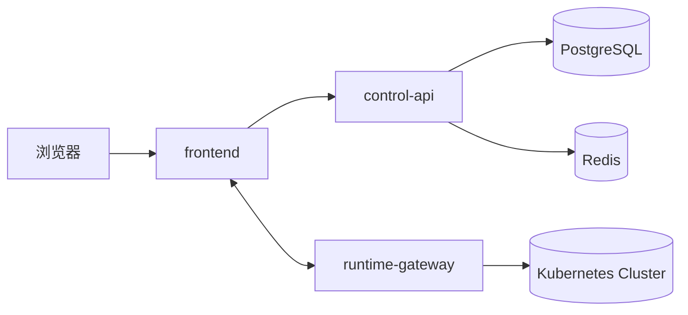

# KubeNova

Kubernetes 集群 AI 运维管理平台。

面向多集群场景，提供集群接入、工作负载、网络、存储、配置、监控与实时联动能力。

## 平台介绍

这是一套 Kubernetes 运维管理平台，主要用于把集群、工作负载、网络资源和存储资源统一纳管，并通过控制面 API 与实时网关连接集群侧能力。

### 核心能力

- 多集群接入与管理
- 工作负载管理：Deployment / StatefulSet / DaemonSet / Job / CronJob
- 网络资源管理：Service / Ingress
- 存储资源管理：PV / PVC
- 配置资源管理：ConfigMap / Secret
- 监控与告警视图
- 实时操作联动：日志、执行、端口转发等能力

### 适用场景

- 运维团队统一管理多个 Kubernetes 集群
- 需要在同一平台查看和操作工作负载、网络、存储、配置资源
- 需要在 Linux 主机上通过 `systemd` 或发布目录方式部署
- 需要在内网或自建环境中长期运行

### 架构概览



- `frontend`：管理控制台
- `control-api`：认证、业务 API、数据库访问
- `runtime-gateway`：集群实时网关
- `PostgreSQL`：业务数据存储
- `Redis`：缓存与队列

## 直接部署

推荐 Linux 机器用 `Binary + systemd` 方式部署。按下面顺序执行：

### 1. 准备环境

- 安装基础工具
- 安装 Node.js / npm
- 安装 Go
- 安装 PostgreSQL
- 安装 Redis
- 安装发布所需文件

#### 1.1 安装基础工具

```bash
# RHEL / Rocky / Alma / CentOS / Kylin
sudo yum install -y bash curl tar gzip fuser

# Debian / Ubuntu
sudo apt-get update
sudo apt-get install -y bash curl tar gzip psmisc
```

#### 1.2 安装 Node.js / npm

适用系统：`RHEL / Rocky / Alma / CentOS / Kylin`

##### yum 安装
```bash
curl -fsSL https://rpm.nodesource.com/setup_20.x | sudo bash -
sudo yum install -y nodejs
```

##### 验证
```bash
node -v
npm -v
```

适用系统：`Debian / Ubuntu`

```bash
curl -fsSL https://deb.nodesource.com/setup_20.x | sudo -E bash -
sudo apt-get install -y nodejs
```

验证：
```bash
node -v
npm -v
```

##### 二进制安装
```bash
NODE_VERSION=20.17.0
curl -fsSLO https://nodejs.org/dist/v${NODE_VERSION}/node-v${NODE_VERSION}-linux-x64.tar.xz
sudo mkdir -p /usr/local/lib/nodejs
sudo tar -xJf node-v${NODE_VERSION}-linux-x64.tar.xz -C /usr/local/lib/nodejs
export PATH=/usr/local/lib/nodejs/node-v${NODE_VERSION}-linux-x64/bin:$PATH
```

##### 验证
```bash
node -v
npm -v
```

#### 1.3 安装 Go

适用系统：`RHEL / Rocky / Alma / CentOS / Kylin`

##### yum 安装
```bash
sudo yum install -y golang
```

##### 验证
```bash
go version
```

适用系统：`Debian / Ubuntu`

```bash
GO_VERSION=1.22.5
curl -fsSLO https://go.dev/dl/go${GO_VERSION}.linux-amd64.tar.gz
sudo rm -rf /usr/local/go
sudo tar -C /usr/local -xzf go${GO_VERSION}.linux-amd64.tar.gz
export PATH=/usr/local/go/bin:$PATH
```

验证：
```bash
go version
```

##### 二进制安装
```bash
GO_VERSION=1.22.5
curl -fsSLO https://go.dev/dl/go${GO_VERSION}.linux-amd64.tar.gz
sudo rm -rf /usr/local/go
sudo tar -C /usr/local -xzf go${GO_VERSION}.linux-amd64.tar.gz
export PATH=/usr/local/go/bin:$PATH
```

##### 验证
```bash
go version
```

#### 1.4 安装 PostgreSQL

适用系统：`RHEL / Rocky / Alma / CentOS / Kylin`

##### yum 安装
```bash
sudo yum install -y postgresql-server postgresql
sudo postgresql-setup --initdb
sudo systemctl enable --now postgresql
```

##### 验证
```bash
psql --version
```

适用系统：`Debian / Ubuntu`

```bash
sudo apt-get install -y postgresql postgresql-client
sudo systemctl enable --now postgresql
```

验证：
```bash
psql --version
```

##### 二进制安装（官方源码编译到固定前缀）
```bash
PG_VERSION=16.4
sudo yum install -y gcc make readline-devel zlib-devel openssl-devel
curl -fsSLO https://ftp.postgresql.org/pub/source/v${PG_VERSION}/postgresql-${PG_VERSION}.tar.gz
tar -xzf postgresql-${PG_VERSION}.tar.gz
cd postgresql-${PG_VERSION}
./configure --prefix=/usr/local/pgsql
make -j"$(nproc)"
sudo make install
```

##### 验证
```bash
/usr/local/pgsql/bin/postgres --version
```

#### 1.5 安装 Redis

适用系统：`RHEL / Rocky / Alma / CentOS / Kylin`

##### yum 安装
```bash
sudo yum install -y redis
sudo systemctl enable --now redis
```

##### 验证
```bash
redis-cli --version
```

适用系统：`Debian / Ubuntu`

```bash
sudo apt-get install -y redis-server redis-tools
sudo systemctl enable --now redis-server
```

验证：
```bash
redis-cli --version
```

##### 二进制安装
```bash
REDIS_VERSION=7.2.5
curl -fsSLO https://download.redis.io/releases/redis-${REDIS_VERSION}.tar.gz
tar -xzf redis-${REDIS_VERSION}.tar.gz
cd redis-${REDIS_VERSION}
make
sudo make install
```

##### 验证
```bash
redis-server --version
```

#### 1.6 准备发布目录

```bash
sudo mkdir -p /opt/k8s-aiops-manager/releases/<version>
sudo ln -sfn /opt/k8s-aiops-manager/releases/<version> /opt/k8s-aiops-manager/current
sudo mkdir -p /etc/k8s-aiops-manager
```

#### 1.7 准备环境文件

```bash
sudo cp backend/control-api/.env.example /etc/k8s-aiops-manager/control-api.env
sudo cp deploy/systemd/env/*.env.example /etc/k8s-aiops-manager/
```

### 2. 安装 systemd

```bash
bash scripts/prod-install.sh
```

### 3. 启动服务

```bash
bash scripts/prod-up.sh
```

### 4. 查看状态

```bash
bash scripts/prod-status.sh
```

### 5. 部署后验证

```bash
curl -fsS http://127.0.0.1:3000/ >/dev/null
curl -fsS http://127.0.0.1:4000/api/capabilities >/dev/null
curl -fsS http://127.0.0.1:4100/healthz
```

### 6. 切换和回滚

```bash
bash scripts/prod-switch.sh <version>
bash scripts/prod-rollback.sh <version>
```

### 7. 停止和卸载

```bash
bash scripts/prod-down.sh
bash scripts/prod-uninstall.sh
```

## 发布目录

```text
/opt/k8s-aiops-manager/current
/opt/k8s-aiops-manager/releases/<version>
/etc/k8s-aiops-manager/*.env
```

## 文档

- [Linux 首次部署 Checklist](deploy/docs/linux-first-deploy-checklist.md)
- [Linux 使用说明](deploy/docs/linux-usage.md)
- [Linux 速查卡](deploy/docs/linux-quick-start.md)
- [部署文档总目录](deploy/docs/README.md)

## 其他部署方式

- [Binary + systemd](deploy/docs/binary-systemd.md)
- [Docker Compose](deploy/docs/docker-compose.md)
- [Kubernetes Kustomize](deploy/docs/k8s-kustomize.md)
- [DEB/RPM](deploy/docs/deb-rpm.md)
