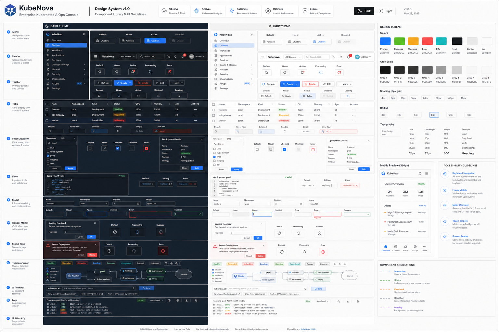
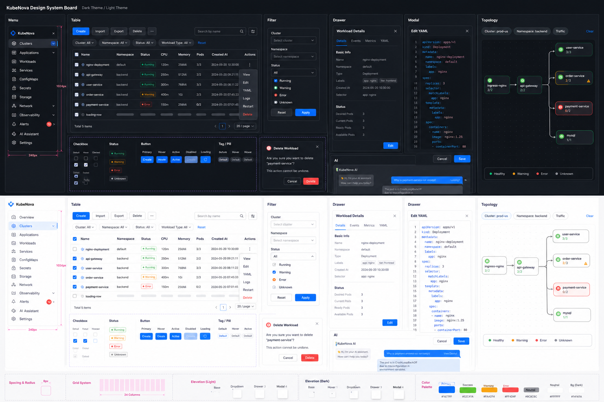

# UI Component Design Plan With GPT Image 2

Date: 2026-06-02

Scope: full frontend static scan for web controls, interface components, and reusable UI component patterns. This is design planning evidence, not browser QA sign-off.

## Evidence

- Navigation routes: `frontend/src/config/navigation.ts`
- Global shell: `frontend/src/components/shell-layout.tsx`
- Shared tables: `frontend/src/components/resource-table/index.tsx`
- Table toolbar: `frontend/src/components/resource-table-toolbar.tsx`
- Detail drawers: `frontend/src/components/resource-detail/resource-detail-drawer.tsx`, `frontend/src/components/resource-yaml-drawer.tsx`, `frontend/src/components/business-detail-drawer.tsx`, `frontend/src/components/cluster-detail-drawer.tsx`
- Actions and menus: `frontend/src/components/resource-action-bar.tsx`, `frontend/src/components/resource-row-actions.tsx`, `frontend/src/components/resource-add-button.tsx`
- Scope filters: `frontend/src/components/resource-scope-filter-button.tsx`, `frontend/src/components/resource-cluster-namespace-filters.tsx`, `frontend/src/components/network-resource-page-filters.tsx`
- Theme tokens and shared CSS: `frontend/src/app/globals.css`

Static count snapshot:

| Item | Count |
| --- | ---: |
| navigation `path:` entries | 39 |
| `page.tsx` files | 46 |
| files using `Modal` or `Modal.confirm` | 32 |
| files using drawer/detail drawer patterns | 40 |
| files using `ResourceTable` | 34 |
| files using `Dropdown` or `Popover` | 26 |

## GPT Image 2 Output

Official target board:

Official generation settings:

- Tool: `gpt-image2`
- Resolution: `1k`
- Aspect ratio: `16:9`
- Output: `docs/assets/gpt-image2_20260602_082225_1.png`
- Intent: formal target for full-site component styling, including Menu, Header, Table, Toolbar, Filter, Dropdown, Drawer, YAML Drawer, Form Modal, Danger Modal, Status Tags, Topology, AI, Terminal/Logs, Mobile, and A11y states.

Historical planning board:

Historical generation settings:

- Tool: `gpt-image2`
- Resolution: `1k`
- Aspect ratio: `16:9`
- Output: `docs/assets/gpt-image2_20260601_000229_1.png`
- Intent: component-system visual plan for menu, table, filter, drawer, modal, AI, and topology surfaces.

Prompt summary:

> Kubernetes KubeNova operations console component planning board, Ant Design feel, compact enterprise density, dark and light themes, 8px radius, no decorative gradient blobs, include menu/table/filter/dropdown/drawer/YAML drawer/modal/topology/AI states.

Official prompt summary:

> Enterprise Kubernetes KubeNova console UI design system board, compact Ant Design style, dark/light themes, semantic blue/green/amber/red/cyan/gray palette, 8px radius, focus ring, hover/active/disabled/loading/error states, no decorative blobs, no purple gradients, no nested cards.

## Current Component Map

| Layer | Current usage | Design direction |
| --- | --- | --- |
| Shell and navigation | AntD `Layout`, `Sider`, `Menu`, top search, avatar dropdown. Theme toggle and notification button now use `OpsIconActionButton`. | Keep left domain navigation as primary IA. Normalize collapsed/mobile behavior later; keep top bar quiet and utilitarian. |
| Resource pages | Most domain pages use shared `ResourceTable`, shared filters, row action dropdowns, and global detail drawer. | Treat resource list as Level 1 work surface. Standard header, toolbar, table density, row action trigger, empty/degraded state. |
| Filters | Scope popover, network filters, table global search, table filter row, topology filter pills. `OpsFilterTriggerButton` now covers scope/facet triggers and topology pills with slot classes. | Define one filter grammar: global keyword, cluster/namespace scope, domain facets, table columns. Same active-count badge semantics. |
| Menus and row actions | `ResourceActionDropdown`, `ResourceRowActions`, `ResourceActionBar`, page-local actions, confirm modal integration. Topology and AI assistant action buttons now route most non-modal actions through `OpsIconActionButton`. | Use one compact trigger style. Keep destructive actions in danger section with confirm copy. |
| Drawers | Resource detail, YAML edit, business detail, cluster detail. Detail/YAML/cluster drawer header and retry actions now use `OpsIconActionButton`; width and content structures still differ. | Define drawer classes: resource detail, editor drawer, business detail, workbench drawer. Align width, footer/header action placement, loading/error state. |
| Modals | Many route-local create/edit/delete flows. | Define modal templates: create/edit form, destructive confirm, credential/kubeconfig, advanced configuration. |
| Status chips | `OpsStatusTag`, `OpsFilterChip`, `StatusTag`, and detail `DetailChipList` cover semantic status/chip display; direct AntD tag usage has been removed from `frontend/src`. | Keep route-level status display on semantic states: success, warning, danger, info, neutral, unknown. Avoid arbitrary color names at route level. |
| Special work surfaces | Topology canvas, AI assistant, terminal, logs, dashboards. | Do not force them into card-heavy list style. Align only header, toolbar, status, overlays, and empty/degraded state. |

## Component Rules

1. Buttons
   Use icon buttons for compact tools: refresh, clear, column setting, YAML, logs, terminal, row menu. Text buttons stay for explicit commands: create, apply, save, delete.

2. Radius and density
   Use 8px radius for normal controls, 999px only for chips/pills. Table rows stay compact; drawers and modals use 24px body padding on desktop and responsive padding on mobile.

3. Overlay hierarchy
   Popover handles local selection; Dropdown handles row actions; Drawer handles persistent detail/edit context; Modal handles blocking decisions.

4. Theme
   Keep semantic CSS tokens in `globals.css`. Reduce route-level hex/rgba where components already have shared tokens.

5. Responsive
   Remove large fixed drawer assumptions before mobile sign-off. Table toolbars wrap; action columns keep stable width; overlay max width must fit `100vw`.

6. Accessibility
   Every icon-only trigger needs `aria-label`. Keyboard paths required for sidebar, filter popovers, row dropdown, drawer close/back/refresh, modal confirm/cancel.

## Proposed Component Taxonomy

| Family | Shared primitive | States required |
| --- | --- | --- |
| Navigation | `AppSider`, nav section item, nav leaf item | default, hover, selected, expanded, disabled, capability-hidden |
| Toolbar | page header action, resource table action, topology action | default, active, disabled, loading |
| Filter | scope filter button, table filter toggle, facet pill, search popover | inactive, active, dirty draft, applied, error |
| Table | resource table, nested table, history table | loading, empty, degraded, sorted, filtered, selected |
| Action menu | row dropdown, bulk action bar, danger confirm | available, unavailable, disabled, danger, loading |
| Drawer | resource detail, YAML editor, business detail, cluster detail | loading, loaded, error, degraded, nested navigation |
| Modal | create/edit form, destructive confirm, credentials, advanced config | pristine, dirty, validating, submitting, failed |
| Status | tag, badge, health dot, severity pill | success, warning, danger, info, neutral, unknown |
| Workbench | topology, AI assistant, terminal, logs | connected, disconnected, streaming, paused, error |

## Implementation Order

| Priority | Work |
| --- | --- |
| P0 | Create the shared ops component namespace under `frontend/src/components/ops/*`. |
| P0 | Normalize drawer width/mobile behavior and close/back/focus paths through `OpsDrawerShell`. |
| P0 | Create modal templates for destructive confirm and create/edit forms; migrate route-local `Modal.confirm` first. |
| P0 | Put Topology and AI Assistant in the first migration batch for visible workbench impact. |
| P1 | Unify row action trigger and menu styling across resource pages. |
| P1 | Convert high-use inline colors to semantic tokens for tags, overlays, buttons, and surface states. |
| P1 | Normalize filter grammar: scope filter, keyword search, facet filters, column filters, clear behavior. |
| P2 | Define status/tag palette and replace direct route-level AntD color strings where practical. |
| P2 | Add full route light/dark and mobile browser matrix for menu, table, popover, drawer, modal, topology, AI, terminal, logs. |

## Folder Migration Checklist

### Phase 1 - Foundation And High-Impact Workbenches

| Folder / file | Migration target | Notes |
| --- | --- | --- |
| `frontend/src/components/ops/*` | New shared component namespace | Add ops tokens/types and reusable shells: `OpsStatusTag`, `OpsSeverityPill`, `OpsDrawerShell`, `OpsFormModal`, `OpsConfirmModal`, `OpsPopoverPanel`, `OpsActionDropdown`, `OpsFilterChip`, `OpsWorkbenchPanel`. |
| `frontend/src/app/globals.css` | Token and global component baseline | Extend `--ops-*` tokens for controls, status, overlay, focus, drawer, modal, workbench. Map existing pod/topology/ai-specific tokens to ops tokens where practical. |
| `frontend/src/components/status-tag.tsx` | Status primitive migration | Route through `OpsStatusTag`; keep compatibility API while removing ad hoc color meaning. |
| `frontend/src/components/visual-system.tsx` | Surface/status consolidation | Reuse ops status and surface tokens; avoid a parallel visual system. |
| `frontend/src/components/resource-action-bar.tsx` | Action dropdown and confirm migration | Move dropdown trigger/menu style to `OpsActionDropdown`; move confirm behavior to shared confirm helper or `OpsConfirmModal`. |
| `frontend/src/components/resource-table-toolbar.tsx` | Toolbar and popover migration | Use ops action button and `OpsPopoverPanel`; keep current table state logic. |
| `frontend/src/components/resource-scope-filter-button.tsx` | Filter popover migration | Small JSX adjustment allowed: panel header/body/footer, fixed apply/reset actions, mobile width guard. |
| `frontend/src/components/resource-facet-filter-button.tsx` | Filter popover migration | Align with scope filter grammar and badge/count rules. |
| `frontend/src/components/resource-detail/resource-detail-drawer.tsx` | Drawer shell migration | Use `OpsDrawerShell`; preserve navigation stack, refresh, YAML action, and query behavior. |
| `frontend/src/components/resource-yaml-drawer.tsx` | Editor drawer migration | Use `OpsDrawerShell`; add editor drawer class and mobile-friendly header action wrapping. |
| `frontend/src/components/cluster-detail-drawer.tsx` | Drawer and confirm migration | Use `OpsDrawerShell`; replace export/delete confirm with ops confirm pattern. |
| `frontend/src/components/business-detail-drawer.tsx` | Drawer shell migration | Use `OpsDrawerShell`; keep detail sections unchanged. |
| `frontend/src/components/ai/delete-session-dialog.tsx` | Danger modal template | First focused `OpsConfirmModal` example. |
| `frontend/src/app/network/topology/page.tsx` | High-impact workbench upgrade | First batch. Small JSX adjustments accepted for toolbar grouping, filter chips, right detail panel, popover panels, and workbench shells. Do not change graph layout algorithm. |
| `frontend/src/app/ai-assistant/page.tsx` | High-impact workbench upgrade | First batch. Small JSX adjustments accepted for session list, message bubbles, composer, settings drawer, attachments, and delete confirm. Do not change chat/session logic. |

### Phase 2 - Core Resource Domains

| Folder | Migration target | Notes |
| --- | --- | --- |
| `frontend/src/app/workloads/*` | Resource list/action/modal/tag migration | Includes Pods, Deployments, StatefulSets, DaemonSets, ReplicaSets, Jobs, CronJobs, create flow, autoscaling. Replace Pod-specific action styling with ops action defaults. |
| `frontend/src/components/workloads/*` | Autoscaling and workload specialized widgets | Migrate table/status/modal/drawer usage after ops primitives land. |
| `frontend/src/app/network/*` except `topology` | Resource list/filter/modal/tag migration | Includes Services, Ingress, IngressRoute, NetworkPolicy, Endpoints, EndpointSlices, Gateway API. Topology is handled in Phase 1. |
| `frontend/src/app/storage/*` | Resource list/status/drawer migration | PV/PVC/SC status tags and YAML/detail drawers. |
| `frontend/src/app/configs/*` | Resource list/modal/drawer migration | ConfigMap, Secret, ServiceAccount create/edit forms and YAML/detail drawers. |
| `frontend/src/app/clusters/*` | Cluster and node UI migration | Cluster health drawer, status tags, stats color tokens, row actions. |
| `frontend/src/app/namespaces` | Namespace list/detail migration | Resource filters, create modal, detail/YAML drawer. |

### Phase 3 - Administration And Delivery

| Folder | Migration target | Notes |
| --- | --- | --- |
| `frontend/src/app/users/*` | IAM modal/tag/table migration | Many role/status tags and form modals; migrate after shared status and modal templates stabilize. |
| `frontend/src/app/security` | Security status/severity migration | Align event severity and filters with ops severity tokens. |
| `frontend/src/app/workloads/helm/*` | Delivery modal/status migration | Helm install/rollback/repository forms and status tags. |
| `frontend/src/app/system/update` | Update status/version tag migration | Version tags, audit state, install/rollback status. |

### Phase 4 - Observability, Dashboards, Runtime

| Folder | Migration target | Notes |
| --- | --- | --- |
| `frontend/src/app/page.tsx` | Dashboard surface migration | Align `SurfacePanel` with ops surface; avoid nested cards. |
| `frontend/src/app/dashboard` | Dashboard migration | Use ops status/surface tokens. |
| `frontend/src/app/monitoring` | Monitoring surface/tag migration | Align severity and time/filter controls. |
| `frontend/src/app/observability` | Observability workbench migration | Drawer width and health/status panels need mobile verification. |
| `frontend/src/app/aiops` | KubeNova center migration | Align incident cards, drawers, severity tags, and workbench controls. |
| `frontend/src/app/inspection` | Inspection modal/tag migration | Capability and report severity tags. |
| `frontend/src/app/terminal` | Runtime toolbar/status migration | Align terminal toolbar, session status, reconnect/empty/error states. |
| `frontend/src/app/logs` | Logs workbench migration | Align log toolbar, stream state, terminal frame, search controls, mobile behavior. |
| `frontend/src/app/login` | Login surface review | Keep brand-specific page, but align buttons/inputs/focus rings with ops tokens. |

## Acceptance Gates

- Static: no new page-local modal/action/filter pattern unless justified by special surface.
- Browser: all 39 navigation entries load in light and dark mode with no console/page errors.
- Mobile: resource table toolbar, detail drawer, YAML drawer, filter popover, and row menu fit 390px width.
- Keyboard: Tab, Shift+Tab, Enter, Escape paths work for menu, popover, dropdown, drawer, modal.
- Visual: generated board direction matched by implemented tokenized components, not copied pixel-for-pixel.
